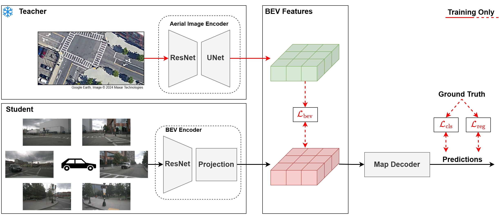

<div align="center">
  <h1>Cross-View Supervision</h1>

  <h3>Learning Ego-Centric BEV Representations from a Perspective-Privileged View:<br>
  Cross-View Supervision for Online HD Map Construction</h3>

  <a href="https://arxiv.org/abs/2605.12218"></a>
  <a href="https://huggingface.co/dlengerer/CrossViewSupervision/tree/main"></a>
</div>

<p align="center">
  
</p>

## Abstract

Bird’s-Eye View (BEV) representations derived from multi-camera input have become a central interface for online HD map construction. However, most approaches rely solely on ego-centric supervision, requiring large-scale scene structure to be inferred from incomplete observations, occlusions, and diminishing information density at long range, where perspective effects and spatial sparsity hinder consistent structural reasoning.

We introduce Cross-View Supervision (CVS), a representation learning paradigm that transfers geometric and topological priors from an ego-aligned overhead perspective into camera-based BEV encoders. Rather than adding auxiliary semantic losses, CVS aligns representations in a shared BEV feature space and distills globally consistent structural knowledge from a perspective-privileged teacher into the ego-centric backbone. This supervision enhances structural coherence without modifying the inference architecture or requiring overhead input at test time.

Experiments on nuScenes using ego-aligned aerial imagery from the AID4AD cross-view extension demonstrate consistent improvements over StreamMapNet while maintaining identical camera-only inference. CVS yields +3.9 mAP in the standard 60 × 30 m region and +9.9 mAP in the extended 100 × 50 m setting, corresponding to a 44% relative gain at long range. These results highlight perspective-privileged structural supervision as a promising training principle for improving BEV representation learning in HD map construction.

## Results

Results on the nuScenes validation split following the StreamMapNet protocol.

| RoI | Method | AP<sub>ped</sub> ↑ | AP<sub>div</sub> ↑ | AP<sub>bound</sub> ↑ | mAP ↑ | Config | Checkpoint |
| :--- | :--- | :---: | :---: | :---: | :---: | :--- | :--- |
| 60×30 m | StreamMapNet | 32.2 | 29.3 | 40.8 | 34.1 | - | - |
| 60×30 m | **StreamMapNet+CVS** | **40.1** | **30.3** | **43.5** | **38.0 (+11%)** | [Config](./plugin/configs/cvs_60x30_24e.py) | [Download](https://huggingface.co/DLengerer/CrossViewSupervision/resolve/main/cvs_60x30/latest.pth) |
| 100×50 m | StreamMapNet | 25.6 | 17.4 | 24.3 | 22.4 | - | - |
| 100×50 m | **StreamMapNet+CVS** | **40.3** | **25.8** | **30.7** | **32.3 (+44%)** | [Config](./plugin/configs/cvs_100x50_24e.py) | [Download](https://huggingface.co/DLengerer/CrossViewSupervision/resolve/main/cvs_100x50/latest.pth) |

The released checkpoints are the final camera-only CVS models; aerial input is not
required during inference.

## Usage

Run all six steps for full reproduction from scratch. For **quick reproduction** of
the reported results, do only Step 1 (download the released CVS checkpoints) and
Step 6. CVS is training-only, so Steps 2–5 (the entire aerial pipeline) can be
skipped.

The commands below use the `100x50` ROI. To run the `60x30` ROI experiments,
replace `100x50` with `60x30` in the corresponding commands.

### Step 1 — Environment & data setup

1. Set up the [environment](https://github.com/yuantianyuan01/StreamMapNet?tab=readme-ov-file#1-environment)
   and the [nuScenes dataset](https://github.com/yuantianyuan01/StreamMapNet?tab=readme-ov-file#2-data-preparation)
   as in StreamMapNet.
2. **Quick reproduction:** download the released CVS checkpoints and place them as:

   ```text
   work_dirs/cvs_100x50/latest.pth
   ```
3. **From scratch:** Clone and set up [AID4AD](https://github.com/DriverlessMobility/AID4AD) as a
   sibling folder of this repository. Follow the AID4AD dataset setup
   instructions to download `AID4AD_tools.zip`, extract the required folders, and
   run `create_dataset.sh` to generate the full-area images. Do **not** run the
   standard AID4AD frame-wise export script; Cross-View Supervision provides its own
   crop-generation scripts in Step 2.

   ```text
   workspace/
   ├── AID4AD/               # AID4AD repo + tooling, satellite tiles
   └── CrossViewSupervision/ # this repository
   ```

### Step 2 — Aerial crop generation 

Run from the repo root; crops are written to `datasets/AID4AD_ego_referenced_{60x30,100x50}`.

```bash
bash tools/aerial_crop_generation/generate_aerial_crops_100x50.sh
```

### Step 3 — Fusion training 

```bash
bash tools/train_fusion_100x50.sh
```

### Step 4 — Teacher extraction 

```bash
python tools/extract_aerial_teacher.py --work-dir work_dirs/fusion_100x50 --output teachers/100x50_teacher.pth
```

### Step 5 — CVS training

Requires the aerial crops (Step 2) and a teacher checkpoint produced in Step 4 (`teachers/`).

```bash
bash tools/train_cvs_100x50.sh
```

### Step 6 — Evaluation 

```bash
bash tools/test_cvs_100x50.sh
```

## Repository Structure

```text
CrossViewSupervision/
├── plugin/                 # configs + model code (CVS, AID4AD fusion, StreamMapNet)
├── tools/
│   ├── aerial_crop_generation/   # generate_aerial_crops_{60x30,100x50}.sh
│   ├── train_fusion_*.sh  train_cvs_*.sh  test_cvs_*.sh  test_fusion_*.sh
│   ├── run_pipeline_*.sh
│   └── extract_aerial_teacher.py  train.py  test.py
├── teachers/               # aerial teacher checkpoints (produced in Step 4, not shipped)
├── datasets/               # nuScenes + generated AID4AD_ego_referenced_* crops
└── resources/
```

## Acknowledgements

This repository is built on
[StreamMapNet](https://github.com/yuantianyuan01/StreamMapNet) (Yuan et al.,
WACV 2024) and uses aerial data tooling from
[AID4AD](https://github.com/DriverlessMobility/AID4AD).

## Citation

If you use this work in your research, please cite:

```bibtex
@article{lengerer2026crossviewsupervision,
  title={Learning Ego-Centric BEV Representations from a Perspective-Privileged View: Cross-View Supervision for Online HD Map Construction}, 
  author={Daniel Lengerer and Mathias Pechinger and Klaus Bogenberger and Carsten Markgraf},
  year={2026},
  journal={arXiv preprint arXiv:2605.12218},
}
```
